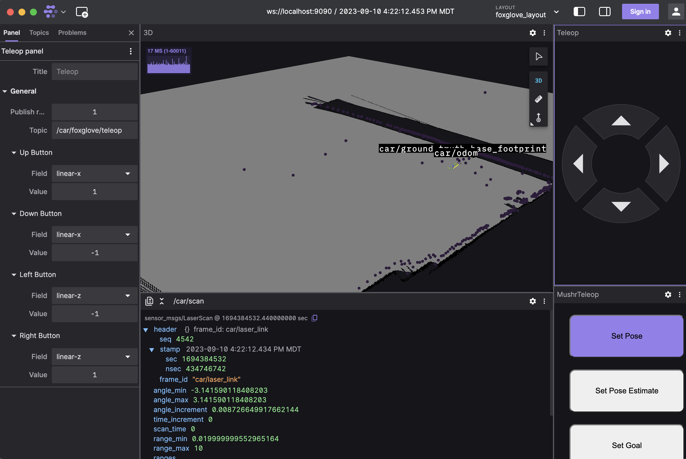
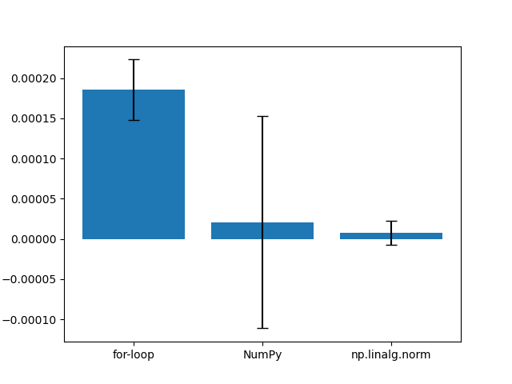
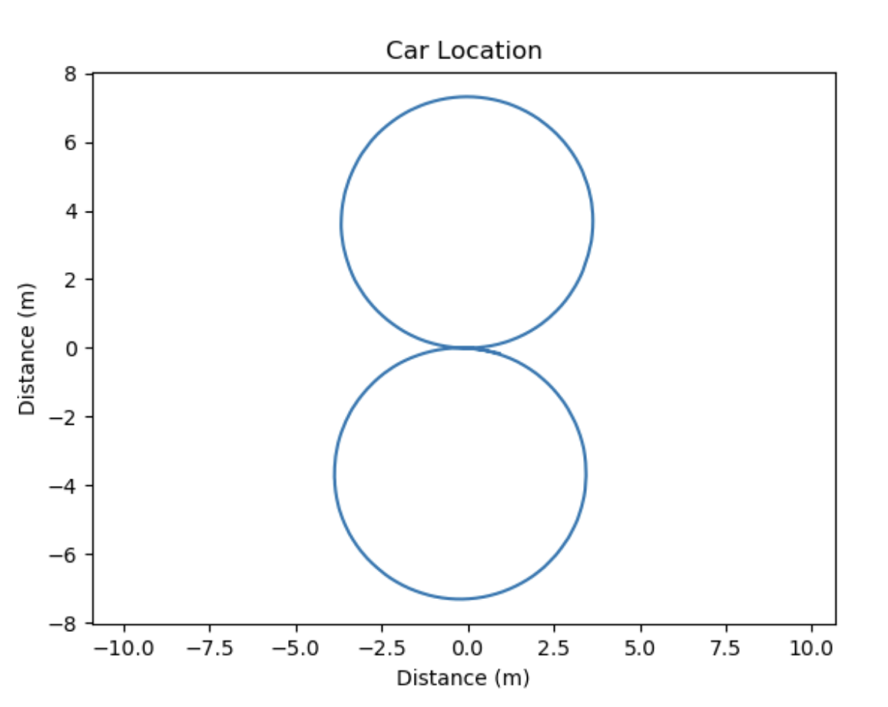
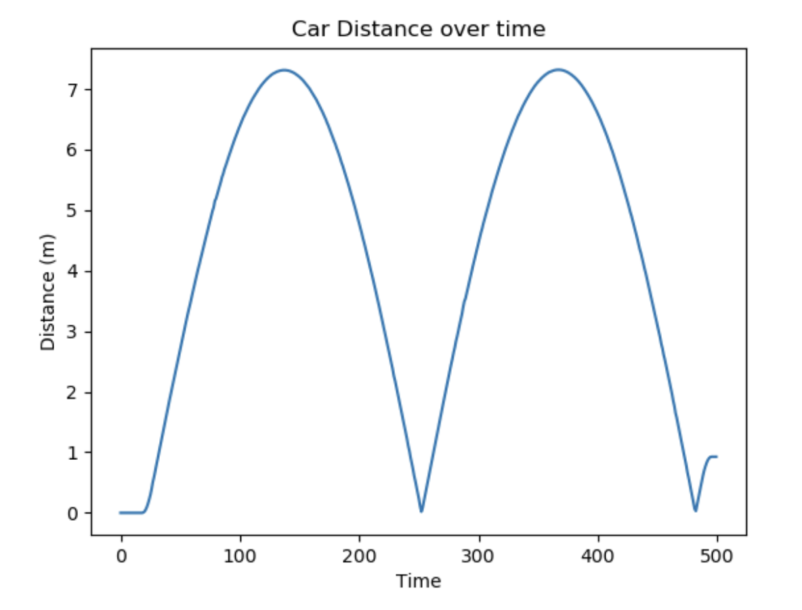
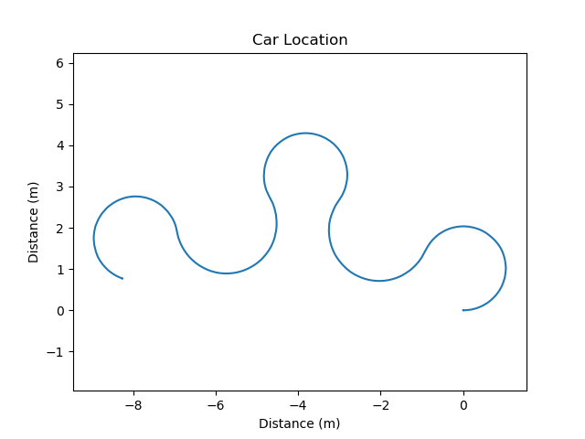
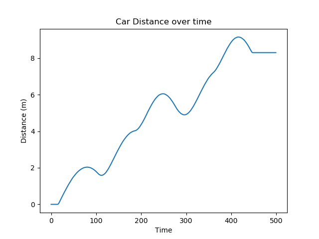

# Project 1: Introduction 

## Qs
 - A Node is an individual process running apart of the ROS system that handles a specific task. These nodes can communicate via a message queue/broker
 - A Topic is a specific “channel” within the ROS message queue that pertains to a specific input/output, for example the “/car/car_pose” topic pushes an object containing the current position of the robot.
 - A publisher is a type of client that can push messages/object onto a specific topic in the ROS message queue, where subscribers can then listen for these messages.
 - A subscriber is a type of client that listens to messages on a specific topic pushed by publishers. This client requires you to specific a callback function which is called on each new message consumed.
 - A launch file is an XML file that depicts how ROS should start a particular node / set of nodes as well as their arguments, parameters and default values.

## Rviz alternative (Foxglove via rosbridge server)

## Runtime Comparison

## Figure 8

### Locations

### Distances

## Tight 8

### Locations

### Distances
